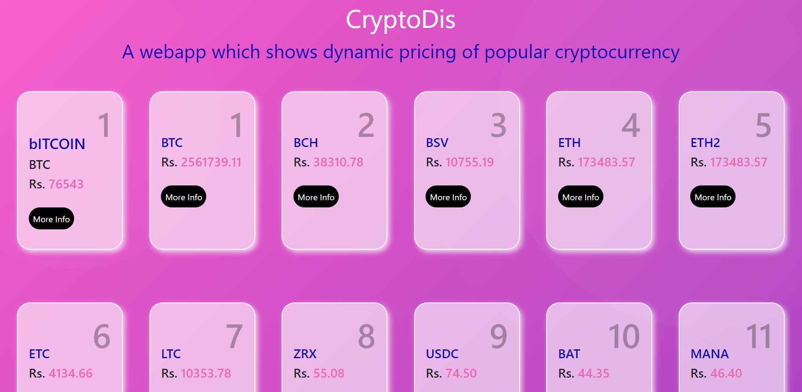

## **CryptoDis**

This web app will fetch the current price of cryptocurrencies of the popular ones.
It is built with the help of Html, Css and Jquery. 

## Features
- Simple
- Fast and Great UI
- Responsive

## Key Points
- Used [fetch](https://developer.mozilla.org/en-US/docs/Web/API/Fetch_API/Using_Fetch) to get the cryptocurrencies data.

- Used [append](https://api.jquery.com/append/) to inject the data into the html body